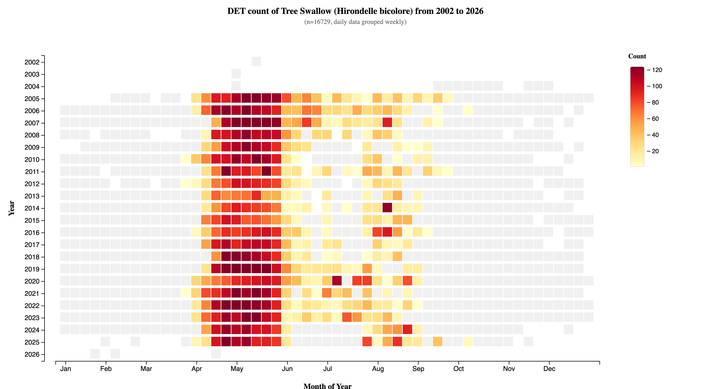
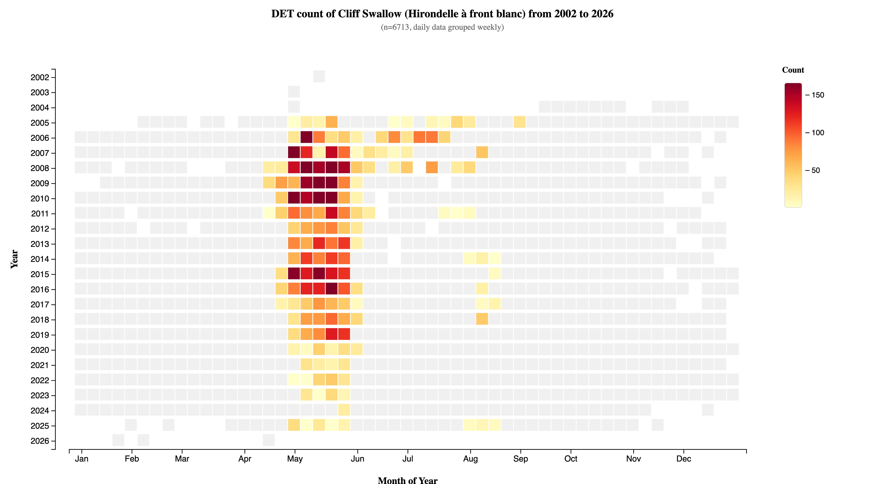
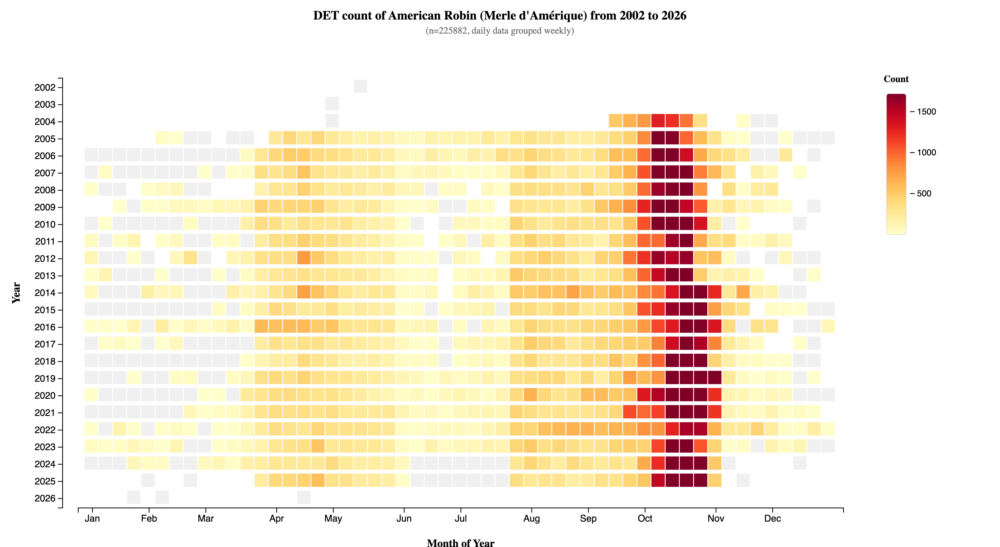
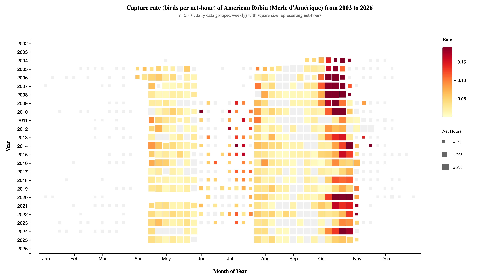
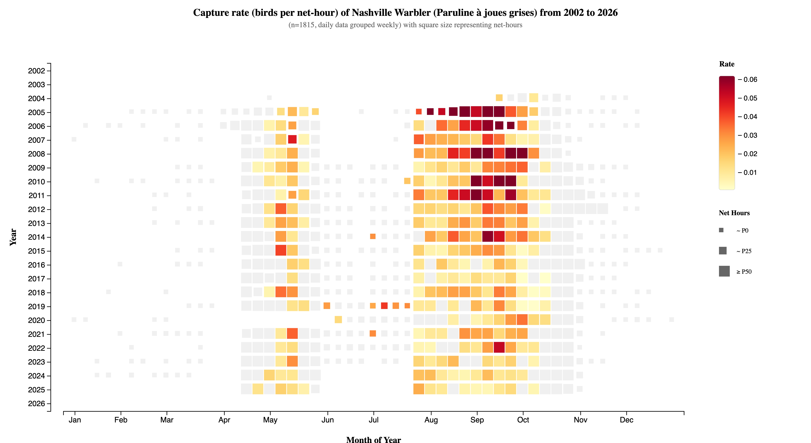
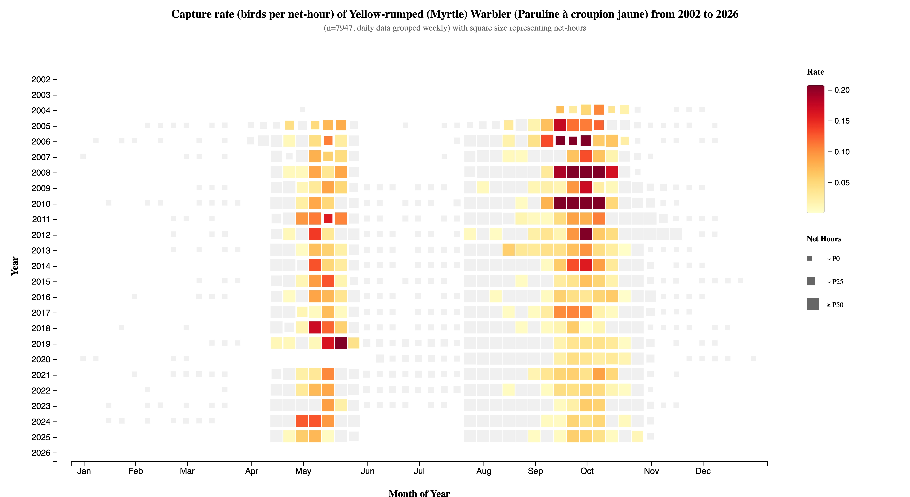
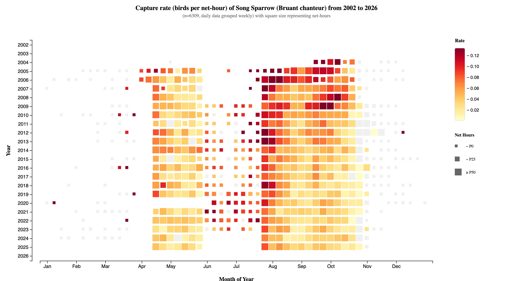
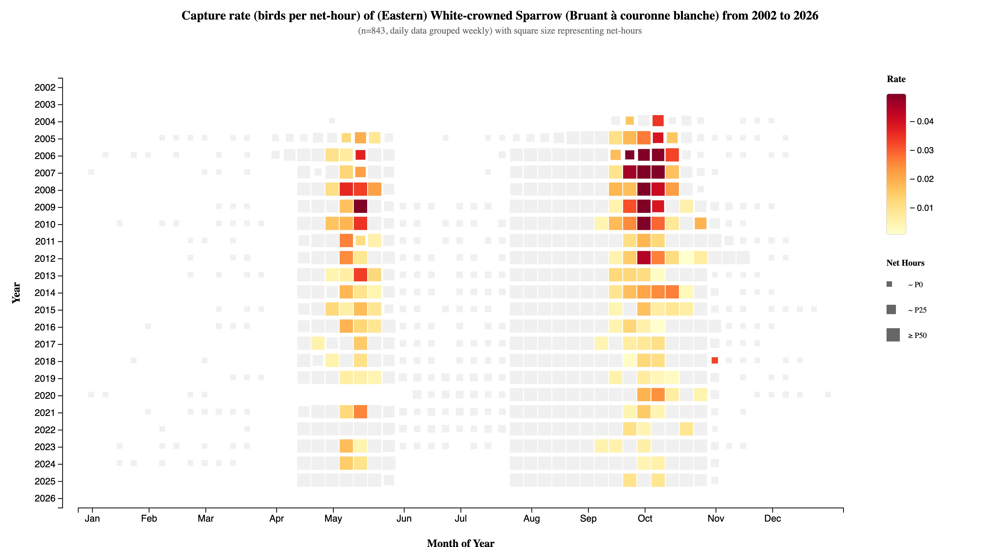
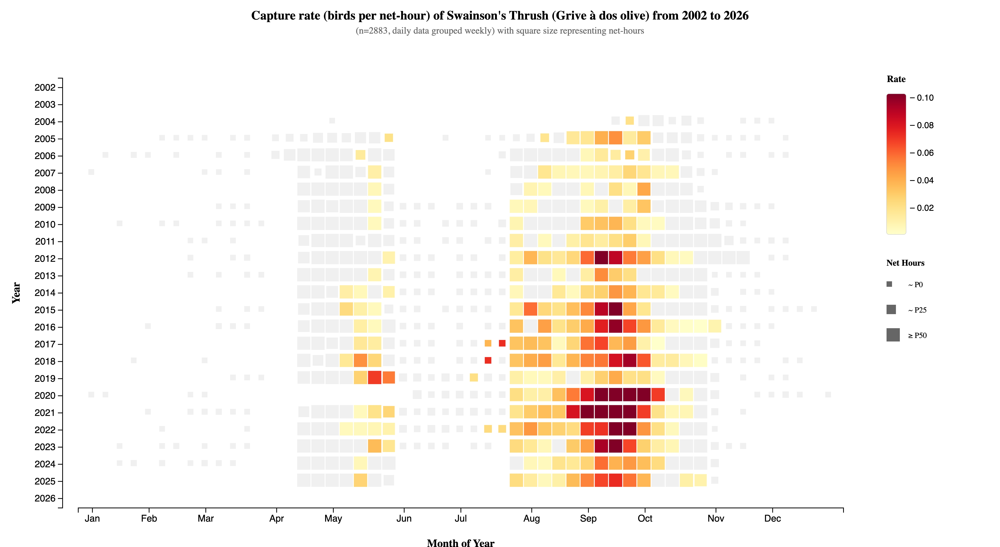

# MBO Species Banding Analysis Report

## 1. Stable vs. Declining DET Trends

### Tree Swallow (TRES) - Stable DET Numbers

Tree Swallow shows consistent DET numbers over the years, indicating stable detection rates across the monitoring period.

### Cliff Swallow (CLSW) - Declining DET Numbers

In contrast to TRES, Cliff Swallow exhibits a clear decline in DET numbers over time, suggesting either population decline or changes in detection probability at the site.

---

## 2. American Robin (AMRO) Temporal Patterns

### Year-Round DET Activity with October Peak

American Robin demonstrates consistent DET numbers throughout the year with a notable increase around October, reflecting autumn migration activity.

### Anomalous September Capture Rate Decline

Despite stable DET numbers, AMRO shows a peculiar yearly decrease in capture rates around September. This discrepancy between detection and capture may indicate:
- Changes in trapping effort timing
- Behavioral shifts making birds less susceptible to capture
- Net placement or configuration changes during this period

---

## 3. Long-term Capture Rate Trends

### Species Showing Declining Capture Rates

Multiple warbler and sparrow species exhibit decreasing capture rates over the monitoring period:

#### Nashville Warbler (NAWA)

#### Magnolia Warbler (MYWA)

#### Song Sparrow (SOSP)

#### Eastern White-crowned Sparrow (EWCS)

These declining trends may reflect:
- Regional population declines
- Shifts in migration routes or timing
- Changes in habitat suitability at the banding site

### Swainson's Thrush (SWTH) - Increasing Capture Rates

In contrast to the declining species, Swainson's Thrush shows an increase in capture rates over time, suggesting either:
- Growing population using the site
- Improved capture techniques for this species
- Habitat changes favoring this species

---

## Summary

These analyses reveal important temporal patterns in bird populations at MBO:
1. **Species-specific DET trends**: Some species maintain stable detection (TRES) while others decline (CLSW)
2. **Seasonal anomalies**: AMRO shows disconnects between detection and capture rates in September
3. **Diverging capture trends**: Most monitored species show declining capture rates, with SWTH as a notable exception

Further investigation is needed to distinguish between true population changes, methodological factors, and environmental shifts driving these patterns.

---

*Report generated from MBO Database - Secret Page Heatmap Visualizations*
